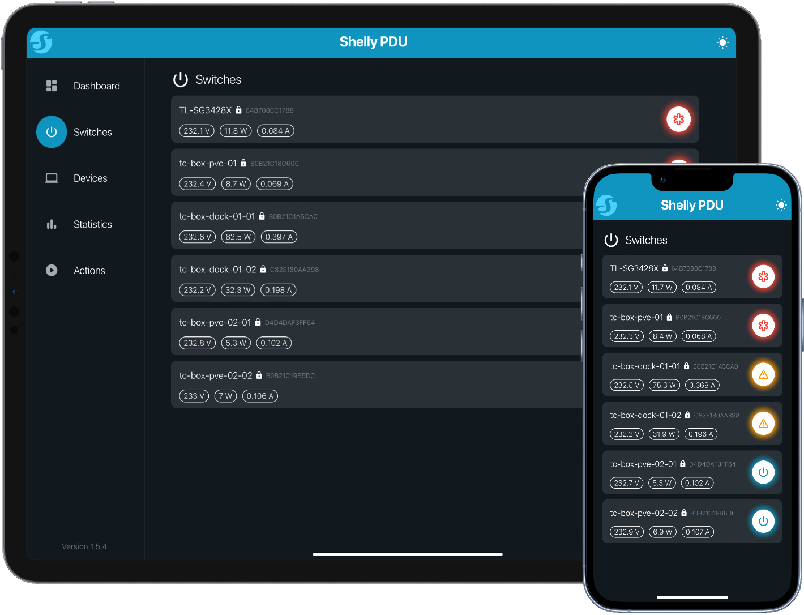

# Shelly-PDU

Shelly PDU is a remote power management tool that uses [Shelly Plug S](https://www.shelly.com/en-de/products/product-overview/shelly-plus-plug-s) devices to monitor power consumption per single port, and provides time-series visualizations as well as remote control. The app uses the Flutter framework as frontend, and a Python Flask server as backend. Additionally, the app uses an external InfluxDB 2 instance to collect time-series data.



**Why Shelly-PDU?**

Compared to a hardware smart PDU this solution is:

- more flexible by scaling up and down in the amount of ports
- is able to provide per-port measurements and control while being only a fraction of the price of a compareable hardware solution
- able to store detailed time-series data over an arbitrary timeframe
- runs on COTS hardware, enabling insights through analytical data processing
- fully open source and thus customizable
- offers a modern and fast UI

On the flipside, hardware smart PDUs offer benefits such as:

- more accuracy in measurements
- more sophisticated features, such as UPS integrations

> [!WARNING]  
> This project is still very young and thus not as mature as other solutions. I do not recommend to use it in a mission-critical scenario.

**Features**:

- Overview over all configured switches in a single interface
- Power-usage history via InfluxDB 2
- Remote toggle switches from the Web-UI
- Define devices as groups of switches
- Supports switches with password authentication
- Supports desktop and mobile layouts
- Define actions to be run on devices (e.g. Shutdown)
- Locate mode utilizing LED as indicator

## Components

Shelly-PDU consists out of three major components:

- Frontend: Serves Flutter Webapp
- InfluxDB: Collects time-series data scraped from switches
- Backend:
  - Scrapes switches and stores data in InfluxDB
  - Proxies requests from the frontend to the switches, handling authentication
  - Handles and performs defined actions on hosts
- Ingress switch: Multiplexes the components above onto a single base url
  - `/api` for the backend
  - `/` for the frontend

## Installation

Docker-compose is the recommended way to deploy the app. In the root of the repository:

```sh
docker-compose up -d
```

## Configuration

The backend requires a configuration file containing all switches, actions and device definitions. It also holds all credentials. A sample configuration file can be found in `config.yml`:

```yml
settings:
  kwh_price: 0.25

actions:
  - name: shutdown                        # Name of the action
    label: Shutdown                       # Full name
    type: ssh                             # Type of the action, currently only 'ssh' supported
    command: "sudo poweroff"              # Command to be run on the host
    icon: 0xf00b8                         # ID of the material icon inside flutter

hosts:
  - id: "64B7085C1788"                    # MAC address of the switch without ':'
    name: my-shelly-plug-s-name           # Easy to read name for the switch
    address: "192.168.0.25"               # IP-address of the switch in the network, ensure static IP
    password: change_me                   # Device password of the shelly plug, remove if no password is set
    script_index: 1                       # Index of the 'exporter.js' script. Open the script editor in the shelly web-ui to obtain the index, e.g. http://192.168.0.25/#/script/1
    priority: "critical"                  # Priority of the switch:
                                          #  - 'critical': The switch cannot be turned off
                                          #  - 'important': The switch can only be turned of with a long press on the power button
                                          #  - default: Leave empty, switch can be turned of with tap on the power button

devices:
  - id: "my-server"
    name: "my-server-name"
    management: "http://192.168.0.35/"    # Management IP of the server, like IPMI or Web-UI
    switches:
      - "64B7085C1788"                    # List of switch IDs that power this server
    ssh_host: "192.168.178.156"           # SSH-accessible IP (required if actions are defined)
    ssh_user: username                    # Username of the SSH user (required if actions are defined)
    ssh_pass: change_me                   # Password of the SSH user (required if actions are defined)
    actions:                              # Define actions that can be performed on this host (optional)
      - shutdown
```

## Adding a Switch to Shelly-PDU

To setup a new Shelly Plug S to work with Shelly-PDU, the backend has to be able to scrape power statistics. To achieve this, a script has to be running on the Shelly Plug:

1. Connect the Shelly Plug to the WiFi that your Shelly-PDU instance will be running on
2. Ensure the Shelly Plug is on the newest firmware
3. Create a new Script in the Shelly Plug Web-UI, and copy the `scripts/exporter.js` script contents into the editor
4. Hit `Save`, start the script and ensure its enabled to always run

This script will expose prometheus metrics on the following URL:

```
http://192.168.0.25/rpc/Script.Eval?id=1&code=getData()
```

Finally, add the switch to the `config.yml` file and restart the backend container.

> [!NOTE]  
> There also exists a simpler implementation that exposes a prometheus endpoint, but this only works without authentication. Using the RPC, authenticated requests can be made, but its a little bit more complex.
